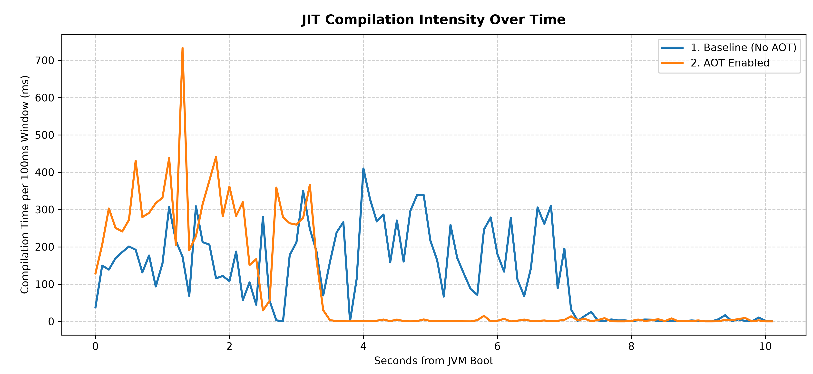

Paperclip
=========
A binary patch distribution system for Paper.

The patching overhead is avoided if a valid patched jar is found in the cache directory.
It checks via sha256 so any modification to those jars (or updated launcher) will cause a repatch.

Building
--------

Building Paperclip creates a runnable jar, but the jar will not contain the Paperclip config file or patch data. This
project consists simply of the launcher itself, the [paperweight Gradle plugin](https://github.com/PaperMC/paperweight)
generates the patch and config file and inserts it into the jar provided by this project, creating a working runnable jar.

Rusty Paperclip
---------------

The `native/` directory contains a Rust reimplementation of Paperclip. This native binary can be downloaded for all major
platforms as a build artifact from the [releases page](https://github.com/PaperMC/Paperclip/releases).

The Rusty Paperclip binary is not standalone, it requires a separate bundler Paperclip jar to run. The native binary is
generally compatible with any version of Paperclip using the bundler scheme (bundler jars were introduced with Minecraft
1.18). Usage is as simple as replacing the `java` command you normally use with the `paperclip` binary.

### Usage

When running the native binary you must pass the Paperclip jar you want to run in via the `-jar` argument, which should
mirror how you already are running the Paperclip jar via `java`. All JVM and application arguments, including `@<file>`
arguments are supported the same as `java`.

```shell
java @aikars.flags -Dpaper.disableOldApiSupport=true -jar paper.jar nogui
```
becomes:
```shell
./paperclip @aikars.flags -Dpaper.disableOldApiSupport=true -jar paper.jar nogui
```

The `paperclip` binary may be placed somewhere on the `PATH` to allow using it as a system-wide command, if you want.

See `paperclip --help` for full usage instructions.

#### AOT Management

For technical details on what the AOT cache is, see the Ahead-of-Time Cache section below. This will just talk about
using AOT features in Paperclip.

There are seven run modes:

| **Mode**         | **Argument**     | **Behavior**                                                                                                                                                                                                                                                                                                                                   |
|------------------|------------------|------------------------------------------------------------------------------------------------------------------------------------------------------------------------------------------------------------------------------------------------------------------------------------------------------------------------------------------------|
| **Default**      | `<none>`         | Rusty Paperclip will record an AOT cache if it is missing or it does not match the current setup. If the cache file matches the current setup it will be used instead. This is the default, simply do not provide any of the following other arguments to use it.                                                                              |
| **Check AOT**    | `--check-aot`    | Check the status of the current AOT cache file. If it matches, Paperclip will immediately return with exit code `0`. If it does not match (or does not exist), it will return with exit code `1`. This can be useful as a check in an automated script.                                                                                        |
| **Only Use AOT** | `--only-use-aot` | Paperclip will require a valid AOT cache file to run. If one is not present, or the existing file is incompatible, it will refuse to start the server and return with exit code `33` instead.                                                                                                                                                  |
| **No Record**    | `--no-record`    | Paperclip will use a valid AOT cache file if one is present. If one is not present, or the existing file is incompatible, it will skip using the AOT cache for this run. This can be useful if you want the server to startup normally (not incurring the startup time penalty of recording a new cache) if the cache becomes invalid.         |
| **Only Record**  | `--only-record`  | Paperclip will record a new AOT cache file if one is missing or the existing cache file is invalid. If the existing cache file is valid Paperclip will immediately return with exist code `0`. If Paperclip does record a new AOT cache it will immediately shut the server down once it has fully started and finished writing the AOT cache. |
| **Force Record** | `--force-record` | This option behaves the same as `--only-record`, except that there is no AOT cache validity check. It will always record a new AOT cache file, and it will always immediately stop the server once the AOT cache file has been fully written.                                                                                                  |
| **No AOT**       | `--no-aot`       | All AOT features will be completely disabled. This is essentially no different from running the Paperclip jar directly with `java`.                                                                                                                                                                                                            |

Only one of these options may be used at any given time. To use one of these arguments it **MUST** be the first argument
presented on the command line, right after `paperclip` (e.g. `paperclip --check-aot`).

When using Paperclip with the default setting, on the first run Paperclip will initiate the AOT cache recording
automatically. Once the server has completed startup, it will write the cache to disk and write the associated metadata
file with it that allows for cache integrity checks. Any future server runs with the same configuration will use and
benefit from that AOT cache file.

> [!CAUTION]
> We cannot verify AOT cache compatibility with plugins, as we have no control over plugin behavior. We have run into at
> least one instance of a plugin causing the AOT cache recording process to fail. We recommend recording the AOT cache
> file without any plugins, starting the server up standalone. You will still receive the benefits described here, as
> the core Minecraft server accounts for the vast majority of classes loaded during the startup process. The AOT cache
> generally isn't going to speed up heavy plugin initialization workloads anyways (it speeds up class loading, not
> class execution).

> [!IMPORTANT]
> In order for Paperclip to use the AOT cache file the full run setup must be _identical_ to the run that recorded it.
> This includes:
>  * The full classpath (including):
>    * The server jar
>    * All library jars
>    * The SHA-256 hash of all classpath jars
>    * The last modified timestamp of all classpath jars
>  * The complete JVM argument list (order matters)
>  * The complete application argument list (order matters)
>  * The SHA-256 hash of the AOT cache file itself
> If any of these values don't match, the AOT cache will be marked invalid and will need to be re-recorded.

### JRE Compatibility

The minimum Java version you can run with Rusty Paperclip is strictly Java 25.0.4. Unfortunately the .4 is necessary, as
Rusty Papercilp uses a JRE API that was added in Java 26 and backported to Java 25.0.4. Any version of Java 26 and
higher, or of Java 25 after 25.0.4 will work as well.

Paperclip finds the JRE using the standard Java locator mechanisms for each platform. The highest priority is always
given to wherever the `JAVA_HOME` environment variable points to. If that environment variable is not present, the
location of the `java` command on the `PATH` may also be used. Other platforms like Windows may also use standard
registry lookups where applicable. It's generally recommended to always set `JAVA_HOME` to be sure you're using the JRE
you expect.

### Ahead-of-Time Cache

The reason Rusty Paperclip exists is to provide a simple-to-use wrapper around
[Project Leyden](https://openjdk.org/projects/leyden/) Ahead-of-Time (or AOT, as it will be referred to from here on)
cache files. These caches provide a significant reduction in server startup time by recording and re-using class loading
data from previous server runs. The Paperclip binary provides utilities for easily managing and using AOT files with
Paper servers. **This is ideally used in applications where Paper servers are stopped and started frequently.** Examples
may include development environments or minigame servers.

#### AOT: Why Rust?

A common question we've gotten is "But why Rust? Couldn't you do this in Java?" or "Why Rust, why not X language
instead?" The answer to the second question is easy: Rust was chosen because it was a language that solved the problem
at hand. Other languages can also effectively solve the same issues; this really has nothing to do with programming
langauge flame wars. Any given project needs _some_ langauge, and Rust is what we picked for this one.

<details>
<summary>Why Rust is a good fit</summary>

As for _why_ Rust is a good fit here: we generally want to use as few system resources as possible for something like
this. CLI programs should ideally be small and fast, so a native application is usually the right call.

Consider what Paperclip has to do:
1. Verify & download the original jar
2. Apply patches to the original jar and any library jars
3. Extract all library jars to build out the classpath
4. Load the classpath into the JVM, and start the server

The Rust code does the exact same process, but by the time we get to step 4 in regular Paperclip, we have a big problem:
The JVM is already running! We can't modify JVM arguments to manage AOT cache files unless we then start
_another_ Java VM as a sub-process. While that is inefficient the real problem there is JVM arguments, when you start
Paperclip with `-Xmx` and other arguments configuring the heap and GC, those wouldn't apply to the sub process unless we
copied them down. That can cause other problems since `-Xms.. and -XX:+AlwaysPreTouch` are commonly recommended when
running Minecraft servers. This means now instead of the one JVM you expected to be running, possibly taking up all of
your system resources, now you have two of them. So copying down JVM arguments isn't a workable idea.

By implementing this tool in any natively compiled language (which we happened to choose Rust in this case) works around
this issue. No JVM is started, and we can manage JVM arguments and other JVM settings directly without additional
overhead. We also get the added benefit of being able to use the JNI API to interact with the JVM directly from our
native code, allowing us to inspect and control the AOT cache recording process.
</details>

#### AOT: What benefits does it provide?

In general, the AOT cache will cut the server startup time in half. This has been remarkably consistent across a variety
of platforms, operating systems, and devices. The reasoning is straightforward: the Minecraft server needs to load a
_lot_ of classes. By pre-computing and saving information about these classes the JVM needs to do dramatically less work
on startup before the server is in a fully started state.

Here are some charts to help visualize where the AOT cache helps.

#### AOT: CPU Utilization


CPU utilization drops off much quicker when using AOT. Since there is less work to do, the full boot process of the
server startup period finishes halfway through the regular startup time. Part of this is the JVM's built-in class
profiling information (which helps the JIT compiler make decisions about how to compile the bytecode) is re-used from
AOT cache, so that work doesn't need to be re-done.

#### AOT: Thread-Time Cost


To help put a finer point on the CPU utilization, this chart shows the dramatic reduction in both class loading and JIT
compilation. The primary benefit the AOT cache provides is during class loading, which you can see is almost entirely
eliminated with the AOT cache. But the JIT compilation improvements are significant too, with the AOT cache run doing
roughly 33% less JIT compilation work than the regular run.

#### AOT: JIT Intensity


Finally, to combine the findings of the two charts into one, this chart shows the amount of runtime the JVM is spending
towards JIT compilation of the classes during the class loading process. This may be the most dramatic of the three
charts, as the drop off of the orange AOT run almost perfectly drops to 0 halfway through the non-AOT run.
